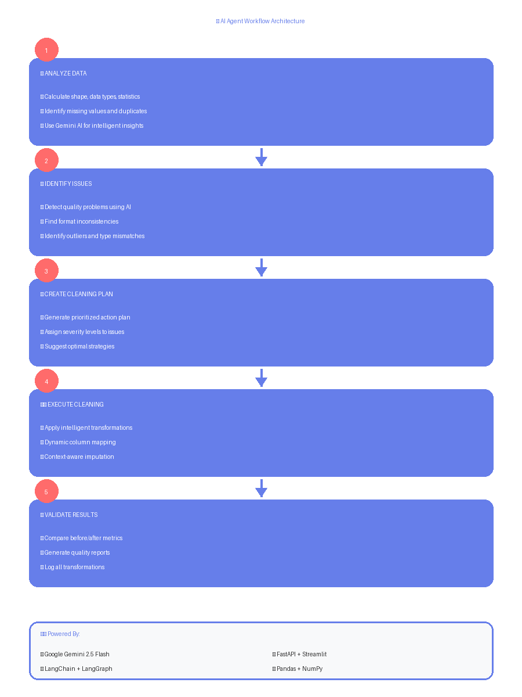

# 🤖 AI-Powered Data Cleaning System

An intelligent data cleaning application that leverages **LangChain**, **LangGraph**, and **Google Gemini AI** to automatically identify and fix data quality issues. The system provides both an interactive Streamlit interface and a RESTful API for seamless integration.

[](https://www.python.org/downloads/)
[](https://fastapi.tiangolo.com/)
[](https://streamlit.io/)
[](https://www.langchain.com/)

---

## 📋 Table of Contents

- [Overview](#overview)
- [Key Features](#key-features)
- [Architecture](#architecture)
- [Tech Stack](#tech-stack)
- [Installation](#installation)
- [Usage](#usage)
- [Project Structure](#project-structure)
- [API Documentation](#api-documentation)
- [How It Works](#how-it-works)
- [Configuration](#configuration)
- [Examples](#examples)
- [Future Enhancements](#future-enhancements)

---

## 🎯 Overview

This project implements an **AI Agent-based data cleaning pipeline** that intelligently analyzes datasets, identifies quality issues, creates cleaning plans, and executes automated cleaning operations. Unlike traditional rule-based systems, this solution uses Large Language Models (LLMs) to understand context and make intelligent decisions about data quality.

### Problem Solved
Data cleaning typically consumes 60-80% of a data scientist's time. This system automates the entire process by:
- Intelligently detecting data quality issues
- Understanding context and domain-specific patterns
- Automatically applying appropriate cleaning strategies
- Validating results and providing detailed reports

---

## ✨ Key Features

### 🧠 AI-Powered Analysis
- **Intelligent Issue Detection**: Uses Google Gemini to identify data quality problems
- **Context-Aware Cleaning**: Understands domain-specific patterns (e.g., age formats, gender variations)
- **Automated Planning**: Creates prioritized cleaning strategies based on issue severity

### 🔧 Comprehensive Data Cleaning
- ✅ Duplicate removal
- ✅ Missing value imputation (median, mode, forward/backward fill)
- ✅ Outlier detection and removal (IQR, Z-score methods)
- ✅ Text standardization and whitespace removal
- ✅ Data type conversion and validation
- ✅ Inconsistent format standardization
- ✅ Value mapping and normalization

### 🚀 Multiple Interfaces
- **Streamlit Web App**: Interactive UI for non-technical users
- **REST API**: Programmatic access via FastAPI
- **CLI Tool**: Command-line interface for automation

### 📊 Data Source Support
- CSV files
- Excel spreadsheets (`.xlsx`, `.xls`)
- PostgreSQL databases
- REST APIs

### 🔍 Advanced Capabilities
- **LangGraph Workflow**: Multi-stage agentic pipeline (analyze → identify → plan → execute → validate)
- **Dynamic Column Detection**: Handles various naming conventions
- **Detailed Logging**: Complete audit trail of all cleaning operations
- **Before/After Comparison**: Validation reports with metrics

---

## 🏗️ Architecture

The system follows a **multi-agent workflow** using LangGraph:



### Data Flow
```
Input Data → Data Ingestion → AI Agent → Cleaned Data → Validation Report
```

**5-Stage AI Agent Pipeline:**

1. **Analyze Data** - Creates dataset summary with statistics and AI insights
2. **Identify Issues** - Detects quality problems using Gemini AI
3. **Create Cleaning Plan** - Generates prioritized action plan with severity levels
4. **Execute Cleaning** - Applies intelligent transformations and fixes
5. **Validate Results** - Compares before/after metrics and generates reports

---

## 🛠️ Tech Stack

| Category | Technologies |
|----------|-------------|
| **AI/ML** | Google Gemini 2.5 Flash, LangChain, LangGraph |
| **Backend** | FastAPI, Uvicorn, SQLAlchemy |
| **Frontend** | Streamlit |
| **Data Processing** | Pandas, NumPy |
| **Database** | PostgreSQL |
| **Environment** | Python-dotenv |

---

## 📦 Installation

### Prerequisites
- Python 3.8 or higher
- Google Gemini API key ([Get one here](https://ai.google.dev/))
- PostgreSQL (optional, for database features)

### Step 1: Clone the Repository
```bash
git clone https://github.com/greninja010601/AI-agent-data-cleaning.git
cd AI-agent-data-cleaning
```

### Step 2: Create Virtual Environment
```bash
# Windows
python -m venv venv
venv\Scripts\activate

# macOS/Linux
python3 -m venv venv
source venv/bin/activate
```

### Step 3: Install Dependencies
```bash
pip install -r requirements.txt
```

### Step 4: Environment Configuration
Create a `.env` file in the project root:

```env
# Required: Google Gemini API Key
GOOGLE_API_KEY=your_gemini_api_key_here

# Optional: Database Configuration
DB_HOST=localhost
DB_PORT=5432
DB_NAME=student_data_db
DB_USER=postgres
DB_PASSWORD=your_db_password
```

### Step 5: Test Your Setup
```bash
# Test Gemini API connection
python test_gemini.py

# Test environment variables
python test_env.py

# Test database connection (optional)
python check_table.py
```

---

## 🚀 Usage

### Option 1: Streamlit Web Interface (Recommended for Demos)

```bash
streamlit run scripts/app.py
```

Then open your browser to `http://localhost:8501`

**Features:**
- Upload CSV/Excel files
- View data preview and statistics
- Run AI-powered cleaning with one click
- Download cleaned data
- See detailed cleaning reports

---

### Option 2: REST API

#### Start the API Server
```bash
python scripts/main.py api --port 8000
```

#### API Endpoints

**Upload File:**
```bash
curl -X POST "http://localhost:8000/upload/csv" \
  -F "file=@your_data.csv"
```

**Clean with AI:**
```bash
curl -X POST "http://localhost:8000/clean/ai?filepath=uploads/your_file.csv"
```

**Download Cleaned File:**
```bash
curl "http://localhost:8000/download/cleaned/cleaned_file.csv" \
  -o cleaned_output.csv"
```

Interactive API documentation available at: `http://localhost:8000/docs`

---

### Option 3: Command Line Interface

```bash
# Clean a CSV file
python scripts/main.py clean --file data/messy_data.csv

# Clean from database
python scripts/main.py clean --table students

# Run system test
python scripts/main.py test
```

---

## 📁 Project Structure

```
AI-agent-data-cleaning/
│
├── scripts/                          # Main application code
│   ├── ai_agent.py                   # AI Agent with LangGraph workflow
│   ├── backend.py                    # FastAPI REST API endpoints
│   ├── app.py                        # Streamlit web interface
│   ├── data_cleaning.py              # Traditional cleaning methods
│   ├── data_ingestion.py             # Multi-source data loading
│   ├── main.py                       # CLI entry point
│   ├── preprocessing.py              # Data preprocessing utilities
│   └── test_postgress_connection.py  # Database connection test
│
├── check_table.py                    # Database table checker utility
├── test_env.py                       # Environment configuration test
├── test_gemini.py                    # Gemini API connection test
│
├── requirements.txt                  # Python dependencies
├── .env.example                      # Environment variables template
├── .gitignore                        # Git ignore rules
├── architecture_diagram.png          # Architecture flowchart
└── README.md                         # This file
```

---

## 📚 API Documentation

### Health Check
```http
GET /
```
Returns API status and version.

### Upload CSV
```http
POST /upload/csv
Content-Type: multipart/form-data

{
  "file": <csv_file>
}
```

**Response:**
```json
{
  "status": "success",
  "filepath": "uploads/20240101_120000_data.csv",
  "shape": [1000, 8],
  "columns": ["age", "gender", "department", ...],
  "missing_values": 45,
  "duplicates": 12
}
```

### AI Cleaning
```http
POST /clean/ai?filepath=<file_path>
```

**Response:**
```json
{
  "status": "success",
  "original_shape": [1000, 8],
  "cleaned_shape": [988, 8],
  "missing_before": 45,
  "missing_after": 0,
  "download_url": "/download/cleaned/cleaned_file.csv",
  "cleaned_file": "cleaned/20240101_120000_ai_cleaned.csv"
}
```

### Traditional Cleaning
```http
POST /clean/traditional?filepath=<file_path>
Content-Type: application/json

{
  "remove_duplicates": true,
  "handle_missing": "fill_median",
  "remove_outliers": true,
  "standardize_text": true
}
```

### List Files
```http
GET /files/uploads
GET /files/cleaned
```

### Download File
```http
GET /download/<filepath>
```

---

## 🔍 How It Works

### 1. Data Analysis Phase
The AI agent first analyzes your dataset:
- Calculates shape, data types, and basic statistics
- Identifies missing values and duplicates
- Samples data to understand patterns
- Uses Gemini AI to provide insights

### 2. Issue Identification
The system detects various quality issues:
- **Missing Values**: Identifies columns with nulls
- **Format Inconsistencies**: Detects "yes/Yes/YES" variations
- **Data Type Mismatches**: Numbers stored as text
- **Invalid Values**: Out-of-range or malformed data
- **Whitespace Issues**: Leading/trailing spaces
- **Duplicates**: Identical rows

### 3. Cleaning Plan Creation
Gemini AI generates a prioritized action plan:
- Assigns severity levels (high/medium/low)
- Suggests specific remediation strategies
- Orders operations for optimal results

### 4. Execution
The system applies intelligent transformations:
- **Dynamic Column Mapping**: Handles "age", "Age", "AGE" automatically
- **Context-Aware Imputation**: Uses appropriate strategies per column
- **Value Standardization**: Normalizes categorical values
- **Outlier Handling**: Caps/removes extreme values

### 5. Validation
Final quality checks:
- Compares before/after metrics
- Generates detailed reports
- Logs all transformations

---

## ⚙️ Configuration

### Cleaning Strategies

The system supports multiple imputation strategies:

| Strategy | Description | Use Case |
|----------|-------------|----------|
| `fill_median` | Fill with column median | Numeric data with outliers |
| `fill_mean` | Fill with column mean | Normally distributed numeric data |
| `fill_mode` | Fill with most frequent value | Categorical data |
| `fill_forward` | Forward fill (propagate last valid) | Time series data |
| `fill_backward` | Backward fill | Time series data |
| `drop` | Remove rows with missing values | When data is sparse |

### Outlier Detection Methods

- **IQR (Interquartile Range)**: Default threshold = 1.5
- **Z-Score**: Default threshold = 3.0

---

## 💡 Examples

### Example 1: Cleaning Student Data

**Input CSV (`messy_students.csv`):**
```csv
age,gender,department,attendance_percent,graduated
twenty,m,comp sci,110,yes
21,Female,Biology,95,Yes
twentytwo,MALE,CS,85,YES
,f,,75,no
```

**Issues Detected:**
- Age has text values ("twenty", "twentytwo")
- Gender has inconsistent formats (m/Female/MALE)
- Department has abbreviations (comp sci/CS)
- Attendance > 100% (invalid)
- Missing values in multiple columns

**After Cleaning:**
```csv
age,gender,department,attendance_percent,graduated
20,Male,Computer Science,100,Yes
21,Female,Biology,95,Yes
22,Male,Computer Science,85,Yes
21,Female,Computer Science,75,No
```

**Actions Taken:**
- ✅ Converted word numbers to digits
- ✅ Standardized gender values
- ✅ Normalized department names
- ✅ Capped attendance at 100%
- ✅ Filled missing values with median/mode

---

### Example 2: API Integration

```python
import requests

# Upload file
with open('data.csv', 'rb') as f:
    response = requests.post(
        'http://localhost:8000/upload/csv',
        files={'file': f}
    )
    filepath = response.json()['filepath']

# Clean with AI
response = requests.post(
    f'http://localhost:8000/clean/ai?filepath={filepath}'
)
result = response.json()

print(f"Original: {result['original_shape']}")
print(f"Cleaned: {result['cleaned_shape']}")
print(f"Missing values: {result['missing_before']} → {result['missing_after']}")

# Download cleaned file
download_url = result['download_url']
cleaned_data = requests.get(f'http://localhost:8000{download_url}')
with open('cleaned_output.csv', 'wb') as f:
    f.write(cleaned_data.content)
```

---

### Example 3: CLI Usage

```bash
# Clean a file with detailed output
python scripts/main.py clean --file data/students.csv

# Output:
# ============================================================
# AI AGENT DATA CLEANING STARTED (Google Gemini)
# ============================================================
# Initial data shape: (1000, 8)
# 
# ============================================================
# DATA ANALYSIS
# ============================================================
# This appears to be a student dataset with demographic and
# academic performance information...
# 
# [Full cleaning process with detailed logs]
# 
# ✅ Cleaning completed: (1000, 8) → (988, 8)
# 💾 Saved: cleaned_20240101_120000.csv
```

---

## 🚀 Future Enhancements

- [ ] Support for more file formats (JSON, Parquet, Avro)
- [ ] Advanced ML-based anomaly detection
- [ ] Custom cleaning rule builder UI
- [ ] Multi-file batch processing
- [ ] Real-time streaming data cleaning
- [ ] Integration with data catalogs (Apache Atlas, DataHub)
- [ ] Automated data quality monitoring dashboard
- [ ] Support for other LLMs (Claude, GPT-4, Llama)
- [ ] Visual data profiling with interactive charts
- [ ] Explainable AI for cleaning decisions
- [ ] Docker containerization
- [ ] Cloud deployment templates (AWS, GCP, Azure)

---

## 🤝 Contributing

Contributions are welcome! Please follow these steps:

1. Fork the repository
2. Create a feature branch (`git checkout -b feature/AmazingFeature`)
3. Commit your changes (`git commit -m 'Add some AmazingFeature'`)
4. Push to the branch (`git push origin feature/AmazingFeature`)
5. Open a Pull Request

---

## 👤 Author

**Your Name**
- GitHub: [@greninja010601](https://github.com/greninja010601)
- Project: [AI-agent-data-cleaning](https://github.com/greninja010601/AI-agent-data-cleaning)

---

## 🙏 Acknowledgments

- Google Gemini AI for powering the intelligent analysis
- LangChain & LangGraph for the agent framework
- FastAPI for the excellent REST API framework
- Streamlit for the intuitive web interface
- The open-source community for amazing tools and libraries

---

## 📞 Support

If you encounter any issues or have questions:
- Open an issue on [GitHub Issues](https://github.com/greninja010601/AI-agent-data-cleaning/issues)
- Check the [API Documentation](http://localhost:8000/docs) when running locally

---

## 🌟 Show Your Support

If this project helped you, please give it a ⭐️ on GitHub!

---

